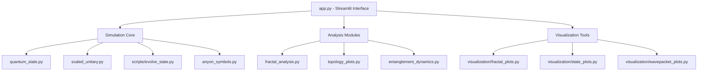

# Recursive Geometric Quantum Scaling (RGQS) System Analysis

## System Architecture Overview

Based on the comprehensive analysis of the codebase, I've mapped out the architecture of the RGQS system, which is designed to explore quantum phenomena through the lens of recursive geometric scaling, fractal properties, and phi-resonance (golden ratio) effects.

## Core Concepts & Implementation

### 1. Quantum State Evolution

The system implements three primary approaches to quantum evolution:

**Standard Evolution:**
- Quantum states evolve under configurable Hamiltonians using QuTiP's solvers
- Various noise models can be applied (relaxation, dephasing, thermal, measurement)
- Implemented primarily in `evolve_state.py` through `run_state_evolution()`

**Phi-Scaled Evolution:**
- Applies scaling factors to Hamiltonians or evolution operators
- Special focus on the golden ratio (φ ≈ 1.618)
- Implementation involves matrix logarithm and exponentiation: U^s = exp(s * log(U))
- Handled in `scaled_unitary.py` via `get_scaled_unitary()`

**Recursive Geometric Evolution:**
- Creates self-similar patterns through recursively applied operations
- Uses a recursive formula: U_φ = U_(t/φ) * U_(t/φ²)
- Implemented in `scaled_unitary.py` through `get_phi_recursive_unitary()`

### 2. Specialized Quantum States

The system defines several specialized quantum states in `quantum_state.py`:

**Standard States:**
- Basic quantum computing states: |0⟩, |1⟩, |+⟩
- Entangled states: GHZ, W-state

**Phi-Sensitive States:**
- `state_phi_sensitive()`: Creates states whose properties depend on proximity to φ
- `state_fractal()`: States with fractal-like correlations
- `state_fibonacci()`: States based on Fibonacci sequence patterns
- `state_recursive_superposition()`: States with recursive, self-similar structure

**Topological States:**
- Anyon-based states using F and R symbols from `anyon_symbols.py`
- Fibonacci, Ising, and Majorana anyonic systems

### 3. Analysis Frameworks

The system includes several analysis frameworks:

**Fractal Analysis:**
- Energy spectrum analysis across varying scaling parameters
- Self-similarity detection in quantum wavefunctions
- Fractal dimension estimation through box-counting methods
- Phi-resonance detection

**Topological Analysis:**
- Calculates topological invariants (Chern number, winding number)
- Analyzes braiding operations for anyonic systems
- Measures protection against perturbations

**Entanglement Analysis:**
- Entanglement entropy measurements
- Entanglement spectrum analysis
- Growth rate calculation

## Critical Issues & Recommendations

Based on the issues document provided, I've identified several critical problems with the current implementation:

### 1. Inconsistent Parameter Application

**Issue:** Multiple instances where scaling factors and phi values are applied redundantly or inconsistently.

**Example:** In `run_state_evolution()`, scaling factors are applied twice: once when constructing the effective Hamiltonian and again when storing the Hamiltonian.

**Recommendation:** Implement a consistent parameter application framework where scaling factors are applied exactly once in each execution path. Document clearly where and how each parameter is applied.

### 2. Mathematically Questionable Phi Injections

**Issue:** Several functions artificially inject phi-dependence into equations that have standard mathematical definitions.

**Example:** Functions like `phi_sensitive_dimension()` and `compute_phi_sensitive_winding()` modify standard mathematical quantities based on proximity to phi without proper theoretical justification.

**Recommendation:** Separate genuine mathematical analysis from phi-sensitivity testing. Implement standard algorithms first, then compare results for different scaling factors including phi, rather than modifying the algorithms themselves.

### 3. Redundant Implementations

**Issue:** Multiple functions implement similar behavior with slight variations, creating maintenance and consistency challenges.

**Example:** The functionality of `run_phi_recursive_evolution()` overlaps with `run_state_evolution()` with `pulse_type == "PhiResonant"`.

**Recommendation:** Refactor to eliminate redundancy. Identify core operations and implement them in a modular way that can be composed to achieve different behaviors without duplicating code.

### 4. Artificial Result Generation

**Issue:** Some metrics appear to be arbitrarily generated rather than derived from actual quantum simulations or established mathematical formulas.

**Example:** `plot_fractal_dim_vs_recursion()` generates arbitrary dimension patterns that may not reflect actual fractal properties.

**Recommendation:** Replace artificial patterns with genuine measurements based on simulation results. Use proper mathematical definitions and cite relevant literature for all metrics.

## Data Collection & Analysis Strategy for Your Paper

To gather meaningful data for your paper despite these issues, I recommend:

### 1. Focus on Core Quantum Evolution

The basic quantum evolution and scaling mechanisms (without recursive or phi-specific modifications) are mathematically sound. For your paper:

- Run the standard quantum evolution with different scaling factors
- Compare evolution under different Hamiltonians
- Measure standard quantum metrics (fidelity, entropy, coherence)

### 2. Authentic Fractal Analysis

For fractal analysis, focus on:

- Energy spectrum analysis with rigorous self-similarity detection
- Standard box-counting fractal dimension without phi-specific modifications
- Wavelet transform analysis of probability distributions

### 3. Data Visualization

Use the visualization components but verify:

- All data is generated from actual simulation results
- No artificial "enhancements" are added
- Proper error bars and statistical significance tests are included

### 4. Comparative Analysis

Since phi is central to your research:

- Compare results for different scaling factors systematically
- Test if phi indeed produces unique effects compared to other values
- Use statistical methods to evaluate significance of any phi-related findings

## Implementation Roadmap

To address the identified issues systematically:

### Phase 1: Core Simulation Cleanup
1. Fix redundant scaling factor application
2. Consolidate overlapping evolution functions
3. Ensure Hamiltonian construction is consistent

### Phase 2: Analysis Framework Refinement
1. Implement mathematically rigorous fractal dimension calculations
2. Replace arbitrary phi injections with proper comparative analysis
3. Ensure topological metrics follow established definitions

### Phase 3: Visualization Enhancement
1. Update visualization to accurately reflect simulation data
2. Add proper error bars and uncertainty visualization
3. Create side-by-side comparisons for different scaling factors

## Guidance for Paper Development

When writing your paper, focus on:

1. **Theoretical Framework**: Develop a clear mathematical basis for why the golden ratio might be special in quantum systems
   
2. **Empirical Results**: Present findings with proper statistical analysis and error estimates
   
3. **Comparative Analysis**: Systematically compare phi with other values to highlight any unique properties
   
4. **Critical Assessment**: Acknowledge limitations and propose future research directions

This structured approach will help you produce a scientifically rigorous paper even while working with a system that has implementation challenges.