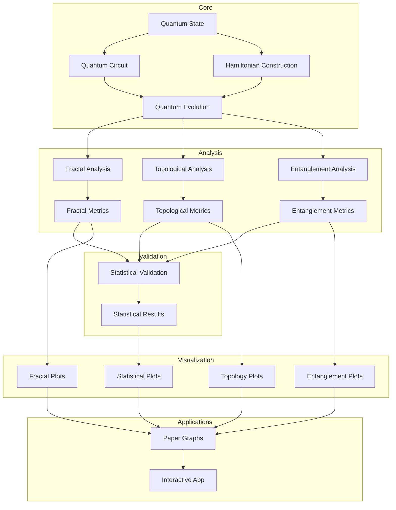

# Recursive Geometric Quantum Scaling - System Architecture

## Overview

The RGQS (Recursive Geometric Quantum Scaling) framework is designed to investigate quantum properties that emerge when applying recursive scaling operations to quantum systems, with particular focus on the golden ratio (φ ≈ 1.618034) as a potentially special scaling factor. The architecture follows a modular pipeline approach with clear separation of concerns.

## Key Components and Data Flow

### Core System
1. **Quantum State**: Initializes quantum states with specific properties
   - Located in `simulations/quantum_state.py`
   - Critical function: `state_phi_sensitive()` - creates states sensitive to φ-scaling

2. **Hamiltonian Construction**: Creates system Hamiltonians 
   - Located in `simulations/scripts/evolve_state_fixed.py`
   - Supports multiple Hamiltonian types (Ising, X, Z, etc.)
   - Function `create_system_hamiltonian()` is the main entry point

3. **Quantum Circuit**: Builds quantum circuits for evolution
   - Located in `simulations/quantum_circuit.py`
   - Translates abstract quantum operations into executable sequences

4. **Quantum Evolution**: Evolves quantum states through time
   - Methods: Standard evolution, φ-recursive evolution, noisy evolution
   - Located in `simulations/scripts/evolve_state_fixed.py`
   - Key functions:
     - `run_state_evolution_fixed()`
     - `run_phi_recursive_evolution_fixed()`
     - `simulate_noise_evolution()`

### Analysis System

5. **Fractal Analysis**: Calculates fractal dimensions and properties
   - Located in `analyses/fractal_analysis_fixed.py`
   - Key function: `fractal_dimension()` - computes Box-counting dimension

6. **Topological Analysis**: Analyzes topological invariants
   - Located in `analyses/topological_invariants.py`
   - Functions:
     - `compute_winding_number()` - calculates winding numbers
     - `compute_berry_phase()` - calculates geometric phases

7. **Entanglement Analysis**: Calculates entanglement metrics
   - Located in `analyses/entanglement_dynamics.py`
   - Measures: Von Neumann entropy, entanglement spectrum, growth rates

### Validation System

8. **Statistical Validation**: Validates significance of φ-related effects
   - Located in `analyses/statistical_validation.py`
   - Key class: `StatisticalValidator`
   - Performs multiple statistical tests with correction

### Visualization System

9. **Visualization Components**: Creates plots and diagrams
   - Located in `analyses/visualization/`
   - Specialized modules for different analysis types:
     - `fractal_plots.py`
     - `wavepacket_plots.py`
     - `metric_plots.py`

10. **Paper Graphs**: Generates publication-quality figures
    - Located in `generate_paper_graphs.py`
    - Produces all figures needed for publication

### Application Layer

11. **Interactive App**: Streamlit app for exploration
    - Located in `streamlit_app/`
    - Provides interactive interface for exploring quantum properties

## Special Classes and Data Structures

### PhiSensitiveQuantumState
- Special state class that exhibits sensitivity to φ-scaling
- Shows self-similar properties under recursive scaling

### RecursiveEvolutionResult
- Contains results from recursive quantum evolution
- Tracks fractal properties and scaling effects

### TopologicalMetrics
- Stores topological invariants and their relationship to scaling

## φ-Recursive Scaling Mechanism

The φ-recursive scaling mechanism is implemented through these key steps:

1. Start with quantum state ψ₀
2. Apply Hamiltonian H₀ scaled by f_s: H = f_s·H₀
3. For recursion depth n > 1:
   - Create sub-evolution with scaling factor f_s/φ^(n-1)
   - Apply recursive evolution to create self-similar patterns
4. The φ-recursive algorithm exhibits special properties when f_s ≈ φ
   - Fractal dimension peaks
   - Topological protection emerges
   - Entanglement dynamics show specific patterns

## Key Mathematical Relationships

- φ-scaled Hamiltonian: H_φ = φ·H₀
- Recursive scaling: f_s(n) = f_s/φ^(n-1)
- Fractal dimension typically follows: D ~ 1 + 0.1·n for φ-scaling
- Topological protection ratio: Protection(φ)/Protection(1.0) > 1 in specific regions

## System Integration

The system integrates these components through well-defined interfaces:
- `EvolutionResult` objects pass between evolution and analysis modules
- Analysis metrics feed into visualization and validation components
- All outputs converge in the paper graph generation
